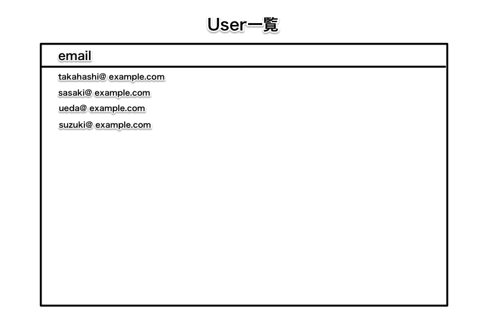
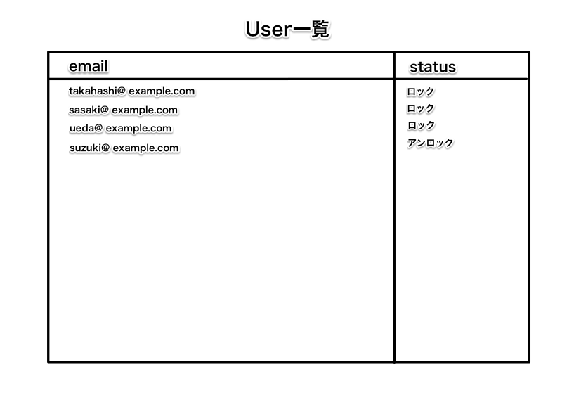

# 応用課題3

ここでは、実務に即し、devise だけでは解決できない課題に挑戦していきます。

## 課題 3.1. 管理者ユーザとユーザの一覧

業務用の Web システムなどを作成していると、全員が同一権限のユーザでは不自然なことがあります。

そこで、下記の仕様を満たしてください。

* 管理者ユーザを登録できるようにしてください
* 管理者ユーザは、他のユーザの一覧を見られるようにしてください
* 管理者以外のユーザがユーザー一覧のページにアクセスした場合、別のページにリダイレクトさせてください
* cancancan、railsadmin等のライブラリを使用せずに実装してください
<br>
<br>
【完成イメージ】<br>
罫線は無くても構いません。<bf>


## 課題 3.2. 管理者によるユーザの強制ロックと解除

SNS などの Web サービスでは、運営者によってユーザのアカウントを一時的にロックするような運用をすることが多々あります。

そこで、下記の仕様を満たしてください。

* 管理者のみ、課題 3.1. で実装したユーザ一覧から、他のユーザのアカウントをロックできるようにしてください
* また、ロックされたユーザは管理者のみ、ロックを解除できるようにしてください
<br>
<br>
【完成イメージ】<br>
罫線は無くても構いません。<bf>

<br>
上記の課題が終わったらコミット、プッシュを行って下さい。
```bash
$ git add .
$ git commit -m "コメントメッセージを入力して下さい"
$ git push origin exercise
```

<br>
プッシュした後にプルリクエストを作成して下さい。<br>
02_応用課題のプルリクエストがクローズされていない場合は、プルリクエストを作成しなくても良いです。<br>
Githubのプルリクエストのページにて、03_応用課題が終わった事をレビュアーに連絡して下さい。
